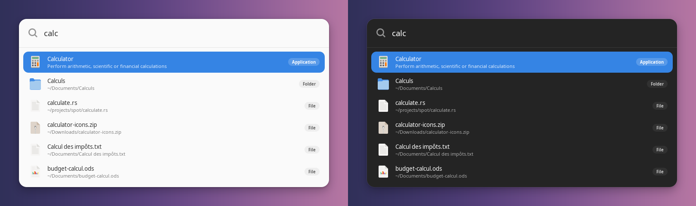
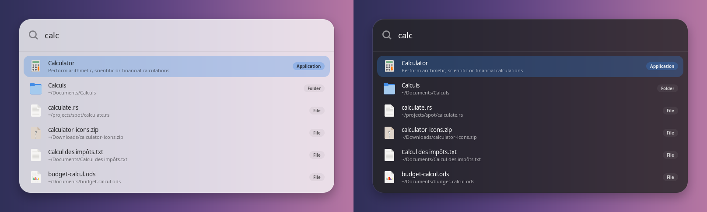
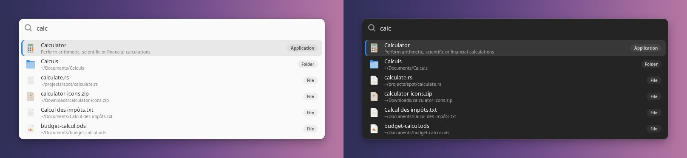

# spot

Application and file launcher for Linux, in Rust + GTK4 / libadwaita. Press a shortcut, type, press Enter: the window is gone as soon as you launch something. Think Raycast or Spotlight, for GNOME and other GTK4 desktops.



[Features](#features) · [Install](#install) · [First run](#first-run) · [Using spot](#using-spot) · [Prefixes](#prefixes) · [Appearance](#appearance) · [Compatibility](#compatibility) · [Troubleshooting](#troubleshooting) · [How it works](#how-it-works) · [Development](#development)

## Features

- **Applications**, matched on name, keywords and executable. The ones you launch often come first.
- **Files** in your home directory, found as you type.
- **Everything the GNOME Activities overview finds**: calculator results, Settings panels, Nautilus files.
- **Commands**: if nothing matches, Enter runs what you typed.
- **Web search**: if nothing matches, a last row hands what you typed to your browser, which searches with its own engine.
- **Prefixes**: `!htop` runs in a terminal, `search: rust` searches in your browser. See [Prefixes](#prefixes).
- **System actions**: lock, suspend, log out, restart, shut down.
- **Instant**: the first launch stays in the background; opening the window takes about 10 ms.
- **Three styles**, light and dark, following the accent colour of your desktop. See [Appearance](#appearance).
- English and French, following the system language.

## Install

| Your system | Go to |
|---|---|
| Arch Linux | [Arch](#arch-linux) |
| Ubuntu 24.04+, Linux Mint 22+, Debian 13 | [Ubuntu, Linux Mint, Debian](#ubuntu-linux-mint-debian) |
| Fedora | [Fedora](#fedora) |
| Anything else with GTK 4.12+ | [Other distributions](#other-distributions) |

There are no prebuilt packages yet: spot is compiled on your machine. Debian 12, Ubuntu 22.04, Linux Mint 21 and older cannot run it, their GTK is older than 4.12. macOS and Windows are not supported, see [Compatibility](#compatibility).

### Arch Linux

The PKGBUILD compiles the latest tagged release and installs it as the `spot-launcher` package, which pacman then tracks like any other. It is not on the AUR yet.

```bash
git clone https://github.com/alarboulletmarin/spot.git
cd spot
makepkg -si
```

Optional: `plocate`, for file search.

### Ubuntu, Linux Mint, Debian

1. Install the build tools and libraries:

   ```bash
   sudo apt install build-essential pkg-config libgtk-4-dev libadwaita-1-dev gettext plocate
   ```

2. Install Rust **1.92 or newer** with [rustup](https://rustup.rs). The `cargo` from apt is too old (Ubuntu 24.04, hence Linux Mint 22, stops at 1.91). Check with `rustc --version`.

3. Build and install:

   ```bash
   git clone https://github.com/alarboulletmarin/spot.git
   cd spot
   make
   sudo make install
   ```

Build and install tested on Ubuntu 24.04.

### Fedora

Same steps as above, with these packages (names not tested):

```bash
sudo dnf install gcc pkgconf-pkg-config gtk4-devel libadwaita-devel gettext plocate
```

Check `rustc --version`: you need 1.92 or newer, use [rustup](https://rustup.rs) if yours is older.

### Other distributions

You need GTK 4.12+ and libadwaita 1 with their development files, `gettext` (for `msgfmt`), `plocate` for file search, and Rust 1.92+. Then:

```bash
make                    # cargo build --release --locked
sudo make install       # PREFIX=/usr/local by default, PREFIX=/usr for a system-wide install
```

### Upgrading

Run the same commands again (`git pull` first), then restart the background process:

```bash
spot --quit && spot --daemon &
```

## First run

Three things to do once after installing.

**1. Start the background service.** Log out and back in, or start it by hand:

```bash
spot --daemon &
```

**2. Set a keyboard shortcut** that runs the command `spot`. An application cannot grab a global shortcut under Wayland, so your desktop has to do it. On GNOME: Settings → Keyboard → Custom Shortcuts → add `spot`, for example on `Super + Space`. On KDE, Hyprland, Sway…: bind the same command in your desktop or compositor.

**3. Centre the window (Wayland only).** A window cannot position itself under Wayland; the compositor places it. On GNOME:

```bash
gsettings set org.gnome.mutter center-new-windows true
```

On other compositors, add a rule that centres floating windows with the id `dev.andrea.Spot`.

## Using spot

Press your shortcut and start typing.

| Key | Action |
|---|---|
| your shortcut | open, or close when already open |
| `↑` `↓` | navigate |
| `Enter` | launch or open |
| `Ctrl + Enter` | open the folder containing the file |
| `Esc` | close |

The window also closes as soon as it loses focus.

| Type | You get |
|---|---|
| `calc` | the Calculator application if you have one, plus files and folders with `calc` in their name |
| `report` | files in your home directory whose name contains it (from 3 characters) |
| `lock`, `shut` | the matching system action |
| `notify-send hello` | when nothing matches and the first word is a program on your `PATH`: Enter runs the line in the background, without a terminal |
| `zzzqq` | nothing matches: after a third of a second, a last row “Search for…” hands the text to your browser. Below the command row, if there is one |
| `!git status` | a prefix: the command runs in a terminal, see [Prefixes](#prefixes) |
| `search: rust gtk4` | a prefix: your browser searches |

## Prefixes

A prefix turns what you type into an instruction. While one is there, spot searches for nothing else. Spot chooses neither a browser nor a terminal nor a search engine: it uses the ones your system and you have set.

| Type | Enter | Ctrl + Enter |
|---|---|---|
| `!git status` | runs the command in a terminal, which stays open afterwards | the same, but the terminal closes when the command ends |
| `search: rust gtk4` | your default browser searches for it, with its own search engine | |
| `g: …` `ddg: …` `yt: …` `gh: …` | a search on that particular site (Google, DuckDuckGo, YouTube, GitHub), in your default browser | |
| `https://example.com` or `www.example.com` | opens the address in your default browser | |

The space after the colon is optional (`gh:alarboulletmarin/spot`), and so is the case.

**Terminal commands.** `!` runs your shell (`$SHELL`) in your home directory, as an interactive shell, so your aliases and your `PATH` apply. The terminal is the first one found among: `xdg-terminal-exec`, `$TERMINAL`, the default terminal set in GNOME, `x-terminal-emulator`, then the usual ones (GNOME Terminal, Ptyxis, Console, Konsole, Xfce Terminal, Alacritty, kitty, foot, WezTerm, xterm…). The way each is told to run a program was checked on xterm, Xfce Terminal, Terminator, MATE Terminal, LXTerminal, Tilix and Console; for GNOME Terminal, kitty, Alacritty and foot it follows their documentation; Konsole, Ptyxis and WezTerm are untested.

**Web searches.** `search:`, and the last row offered when nothing matches, start your default browser (the one your system has for `https`: GNOME Settings → Default Apps, or `xdg-settings get default-web-browser`) and hand it the words. The browser searches with the search engine you set up in it; spot never picks one. Browsers are not all asked the same way:

| Browser | Asked with |
|---|---|
| Firefox and its forks (LibreWolf, Floorp, Waterfox, IceCat, Zen), GNOME Web | `--search words` |
| Chromium and its derivatives (Chrome, Chromium, Brave, Edge, Vivaldi) | an argument `? words`, which Chromium reads as a search |
| any other | the words alone, and it does what it does with them |

This comes from the sources of Firefox, Chromium and GNOME Web, where both forms are handled; the forks are assumed to keep them, and none of the real browsers was run.

`g:`, `ddg:`, `yt:` and `gh:` are different: they search one particular site, through its address. Add your own as lines of the `[Search]` group of `~/.config/spot/spot.conf`: the text you type replaces `%s`, and the address must start with `http://` or `https://`. A line in the file wins over the built-in keyword of the same name. A line named `search` gives `search:` an address of its own instead of the browser's search.

```ini
# Search: keyword=address
# Terminal: the terminal for `!`, then the argument that introduces the program
[Search]
nix=https://search.nixos.org/packages?query=%s
wiki=https://en.wikipedia.org/w/index.php?search=%s

[Terminal]
Command=alacritty -e
```

Both groups are read when you use them, so there is nothing to restart. Without `[Terminal]`, spot picks the terminal itself.

## Appearance

Spot takes its colours from the desktop. Light or dark follows the system setting, and so does the accent colour where libadwaita publishes it (libadwaita 1.6+, for example GNOME 47+; older versions use Adwaita blue). Like every libadwaita application, it does not follow a custom GTK theme.

Choose a style and a colour scheme in `~/.config/spot/spot.conf`. The file is watched: save it and the open window changes, no restart.

```ini
# Style: default, glass or compact
# ColorScheme: system, light or dark
[Appearance]
Style=glass
ColorScheme=system
```

Comments go on their own line: this format has no end-of-line comments.

### Styles

**`default`**: solid card, the selected row is filled with the accent colour.

**`glass`**: translucent card, larger corners, the selection is a soft tint of the accent colour. It needs a compositor, and there is no blur: GTK cannot blur what is behind a window.



**`compact`**: denser rows, smaller icons, the selection is a neutral tint rather than the accent colour.



### Your own CSS

For anything else, `~/.config/spot/style.css` is loaded after the built-in styles and reloaded the same way. libadwaita's colours can be redefined, and the widgets have classes (`.spot-card`, `.spot-entry`, `.spot-row`, `.spot-icon`, `.spot-title`, `.spot-sub`, `.spot-kind`; they may change between versions):

```css
@define-color accent_bg_color #e66100;
.spot-card { border-radius: 8px; }
```

A mistake in the CSS is reported on the standard error of `spot-resident` and the rest of the file is still applied.

## Compatibility

Linux, on any distribution. The three building blocks are Linux-specific: applications come from `.desktop` files, files from `plocate`, and the resident process is woken over the D-Bus session bus. macOS and Windows are not supported and there is no plan for them: each of those three blocks would have to be rewritten, and Raycast already exists there.

Nothing in the code is tied to Arch; only the `PKGBUILD` is.

| Environment | Status |
|---|---|
| GNOME, Wayland or X11 | first-class, this is what it is built and tested on |
| KDE Plasma, Cinnamon, Hyprland, Sway… | should work, with the Adwaita look and a plain floating window. Not tested on those desktops (see below) |

On a desktop other than GNOME:

- applications whose `.desktop` file says `OnlyShowIn=GNOME` are hidden, that is GLib's rule;
- lock, log out, restart and shut down go through GNOME's session services, so they may do nothing. Suspend goes through `logind` and should work.

| Distribution | Install | Tested |
|---|---|---|
| Arch Linux | `makepkg` | yes |
| Ubuntu 24.04, Linux Mint 22 | `make install`, Rust from rustup | build and install on Ubuntu 24.04 |
| Debian 13, Fedora, openSUSE Tumbleweed | `make install`, Rust from rustup if older than 1.92 | no |

Requirements: GTK 4.12+, libadwaita 1, GLib, `plocate` for file search. Building needs Rust **1.92 or newer** (`rust-version` in `Cargo.toml`, set by the GTK bindings).

## Troubleshooting

**The shortcut does nothing.** The background service is not running. Start it with `spot --daemon &` and make sure the shortcut runs `spot` (try it in a terminal first).

**The window is not centred.** See step 3 of [First run](#first-run).

**File search finds nothing, or misses a recent file.** It uses the `plocate` index, which a timer refreshes daily. Refresh it now with `sudo updatedb`. Only your home directory is searched, hidden entries and `node_modules` are skipped, and the search starts at 3 characters.

**`!command` does nothing, or opens the wrong terminal.** Name the terminal in the `[Terminal]` group, see [Prefixes](#prefixes). A terminal that cannot be found is reported on the standard error of `spot-resident`.

**An application is missing.** It may be hidden on your desktop by `OnlyShowIn=` or `NoDisplay=` in its `.desktop` file.

**A style or an option is ignored.** Run `spot --quit; spot-resident --daemon` in a terminal: a wrong value in `spot.conf` is reported there, and the default is used for that key.

**`requires rustc 1.92` when building.** Your Rust is too old, install a newer one with [rustup](https://rustup.rs).

**Limits.** No clipboard history and no window switcher: under Wayland, a background application can neither watch the clipboard nor list windows.

## How it works

- **Applications**: enumerated with `Gio.AppInfo`, matched on name, generic name, keywords and executable, and refreshed when an application is installed or removed.
- **Files**: `plocate` is queried asynchronously on each keystroke (90 ms debounce, from 3 characters), matched on the file name only. Entries that no longer exist are hidden.
- **Search providers**: spot queries the GNOME Shell search providers over D-Bus, the same ones as the Activities overview, and honours what you enabled in Settings → Search.
- **Commands**: when nothing matches and the first word is a program on your `PATH`, Enter runs the line.
- **Web search**: when nothing matches, a “Search for…” row is added once the sources have had 300 ms to answer, so it does not flash up for every query. It does what `search:` does.
- **Prefixes**: checked before anything else; one that matches replaces the search. Addresses and site searches open with GIO's default handler for `https`. `search:` runs the default browser's own command (the `Exec` line of its desktop entry) with the words added, and terminal commands are launched the same way, through a generated application entry, which is what gives the new window the focus.
- **System actions**: over D-Bus; restart, shut down and log out go through GNOME's confirmation dialog.
- **Resident process**: the first invocation stays in the background with its window already created. Every later `spot` is a small GIO-only binary that asks it over D-Bus to show that window, without loading GTK. On the author's machine that call takes about 10 ms (median), and the very first opening after login is as fast as the next ones (the window is built at startup instead of on first use, which used to cost ~1.9 s).

Ranking is a subsequence score: a literal match always wins, word starts get a bonus, shorter paths break ties. Applications you launch often get a bonus; the counts are in `~/.local/share/spot/usage.json`.

Application names and descriptions are already localized by GLib; the rest of the interface is translated through `po/`.

## Development

```bash
spot --quit; cargo run --release --bin spot-resident -- --daemon &   # run the checkout as the resident instance
make test                           # cargo test + translation files

SPOT_APP_ID=dev.andrea.SpotDev ...  # run next to the installed one (both `spot` and `spot-resident` read it)
```

A checkout runs in English: translations are compiled at install time. To add a language, copy `po/spot.pot` to `po/<lang>.po` and fill in the `msgstr` lines.

## License

MIT
